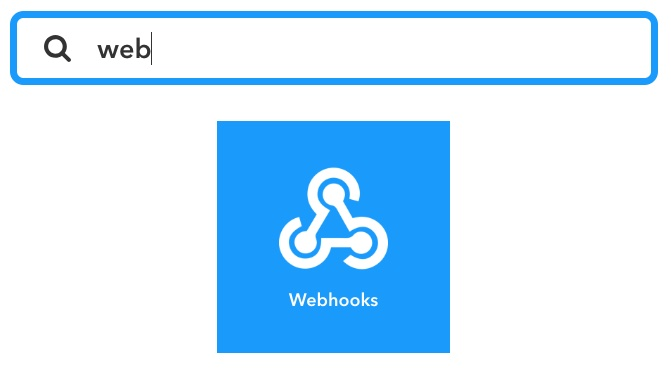
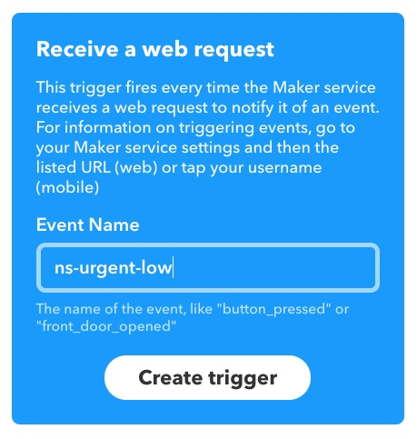
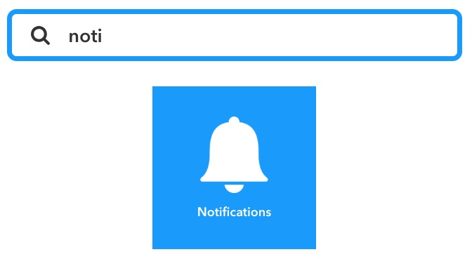
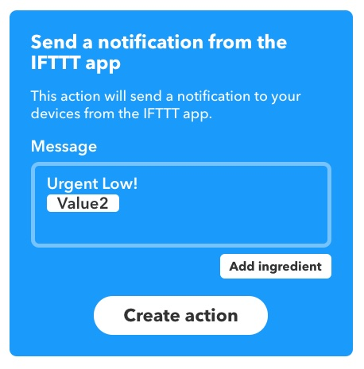
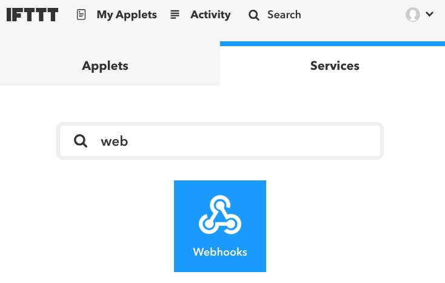
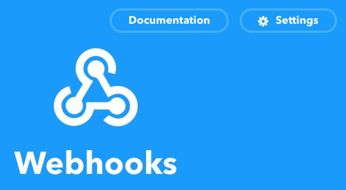
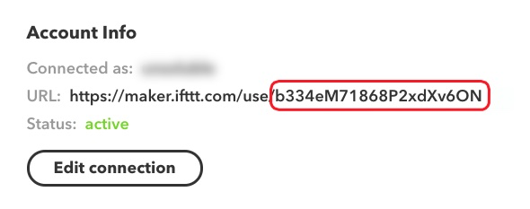

**Table of Contents**

- [Nightscout/IFTTT Maker](#nightscoutifttt-maker)
  - [Overview](#overview)
  - [Events](#events)
  - [Creating an Applet](#creating-an-applet)
    - [1. Choose a Service](#1.-Choose-a-Service)
    - [2. Choose a Trigger](#2.-Choose-a-Trigger)
    - [3. Complete the Trigger field](#3.-Complete-the-Trigger-field)
    - [4. Create an Action](#4.-Create-an-Action)
    - [5. Complete Action Fields](#5.-Complete-Action-Fields)
    - [6. Review and Finish](#6.-Review-and-Finish)
    - [7. Get your Maker Key](#7.-Get-your-Maker-Key)
    - [8. Configure your Nightscout site](#8.-Configure-your-Nightscout-site)
    - [9. Configure the IFTTT mobile app](#9.-Configure-the-IFTTT-mobile-app)

Nightscout/IFTTT Maker
======================================

## Overview

In addition to Nightscout's web-based alarms, your site can also trigger push notifications (or other actions) through the [IFTTT Maker](https://ifttt.com/maker) service. With Maker you are able to integrate with all the other [IFTTT Services](https://ifttt.com/channels). For example, you can send a tweet when there is an alarm, change the color of a smart light, send an email, send a text, and much more.

#### Note: There have been some recent reports of the IFTTT service delaying Nightscout alarms. Be sure to test your implementation before relying solely on its alerts. [Pushover](https://github.com/nightscout/cgm-remote-monitor/blob/dev/README.md#pushover) is an alternate push notification service that might be worth considering as well.

## Events

 Plugins can create custom events, but all events sent to Maker will be prefixed with `ns-`. The core events are:

  * `ns-event` - This event is sent on *all* alarms and notifications. This is good catch-all event for general logging.
  * `ns-allclear` - This event is sent when an alarm has been acknowledged or when the server starts up without triggering any alarms.  (For example, you could use this event to turn a light to green.)
  * `ns-info` - All notifications at the `info` level will cause this event to be triggered.
  * `ns-warning` - All notifications at the `warning` level will cause this event to be triggered.
  * `ns-urgent` - All notifications at the `urgent` level will cause this event to be triggered.
  * `ns-warning-high` - This event is triggered when crossing the `BG_TARGET_TOP` threshold.
  * `ns-urgent-high` - This event is triggered when crossing the `BG_HIGH` threshold.
  * `ns-warning-low` - This event is triggered when crossing the `BG_TARGET_BOTTOM` threshold.
  * `ns-urgent-low` - This event is triggered when crossing the `BG_LOW` threshold.
  * `ns-info-treatmentnotify` - This event is triggered when a treatment is entered into the `careportal`.
  * `ns-warning-bwp` - This event is triggered when the `bwp` plugin generates a warning alarm.
  * `ns-urgent-bwp` - This event is triggered when the `bwp` plugin generates an urgent alarm.

## Creating an Applet
Set up an [IFTTT](https://ifttt.com/) account, and log into it.

### 1. Choose a Service
On the "My Applets" page, click "New Applet", then click the blue `+this`. Search for "webhooks" among the services, and click it.

### 2. Choose a Trigger
Click on the "Receive a web request" box.

### 3. Complete the Trigger field
Enter one of the Nightscout events listed above (like `ns-urgent-low`), and click "Create Trigger".

  
### 4. Create an Action
Click on the blue `+that`.

Search for the action you'd like this event to trigger. In this example, we'll choose the `Notifications` action to send a push notification.

Choose the "Send a notification from the IFTTT app" action type for a basic push alert. You can experiment with the "rich" notifications later.

### 5. Complete Action Fields
Enter the message that will display in this push notification. In this example, it was triggered on an `ns-urgent-low`, so we'll write something like "Urgent Low!". We can also display the current BG by including the `Value2` ingredient (via the "Add ingredient" button).

Click the "Create action" button when you're done.

### 6. Review and Finish
Click the "Finish" button if your applet looks good.

### 7. Get your Maker Key

Click on "My Applets" in the main menu, then click the "Services" tab, then search for "Webhooks" and select it.

Go to the `Settings` for this service, in the upper right.

The string of characters at the end of the URL here is your `MAKER_KEY`. Copy it from there, so we can paste it into your Config Vars.

### 8. Configure your Nightscout site
From your [Heroku dashboard](https://dashboard.heroku.com), go to your app's Settings page, then click the "Reveal Config Vars" button. Find the `MAKER_KEY` entry, and edit its value, pasting in your Maker Key. If you don't already have a `MAKER_KEY` line, add it to the bottom of the list.

Find your `ENABLE` line, and add `maker` to the list of enabled plugins.

### 9. Configure the IFTTT mobile app
That's all of the services complete. In order to receive push notifications on a mobile device, you'll need to have the IFTTT app installed and logged into the same account you set up the actions in.

To add more alerts for different events, just create a new applet for each trigger.

